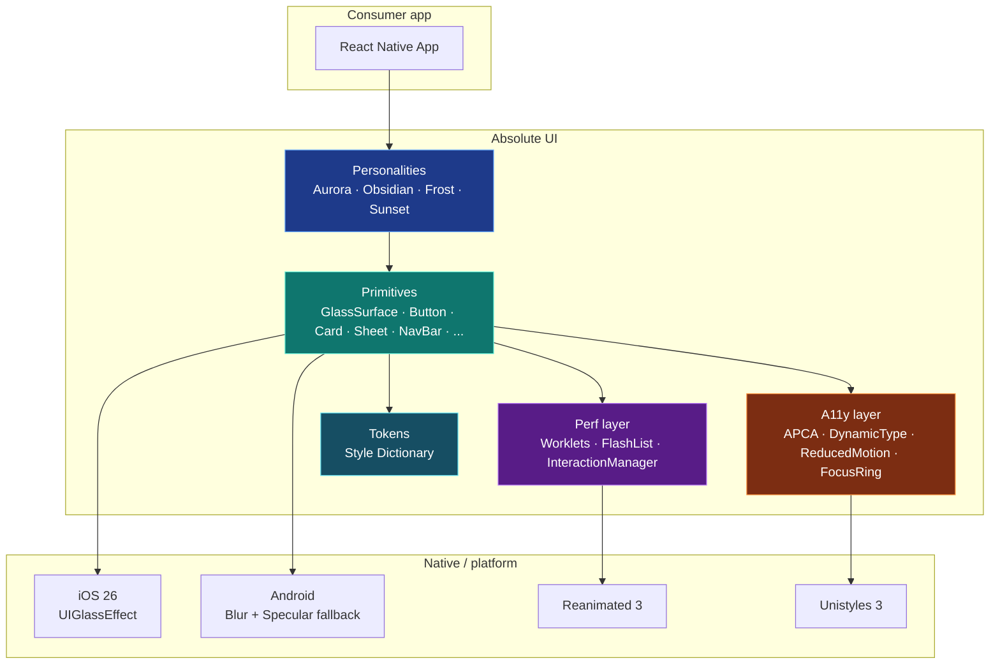
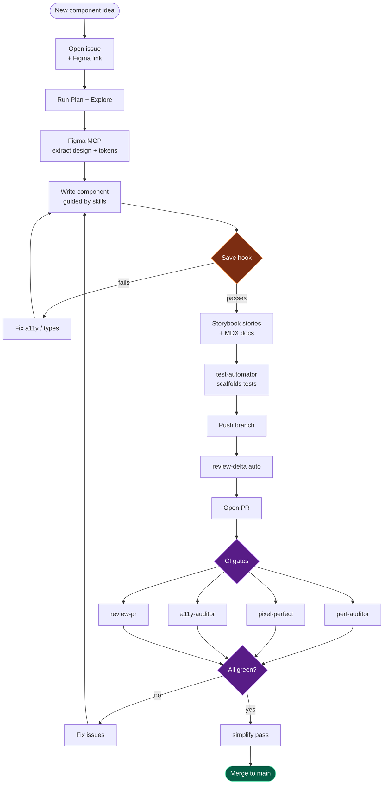
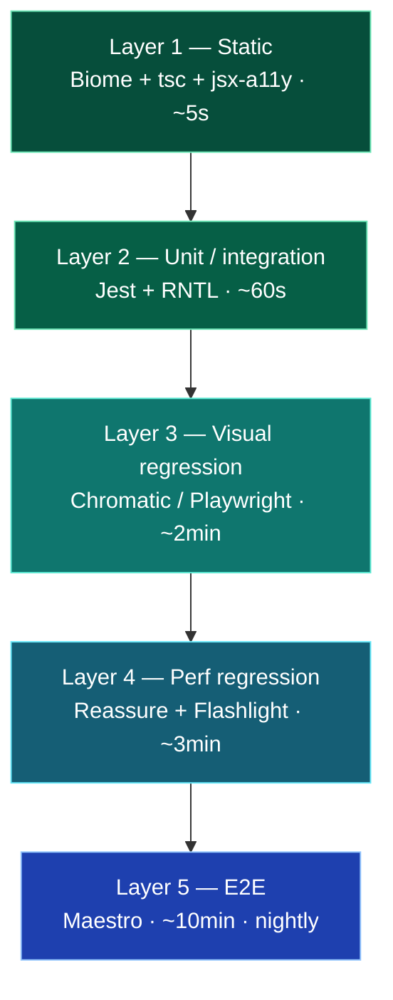
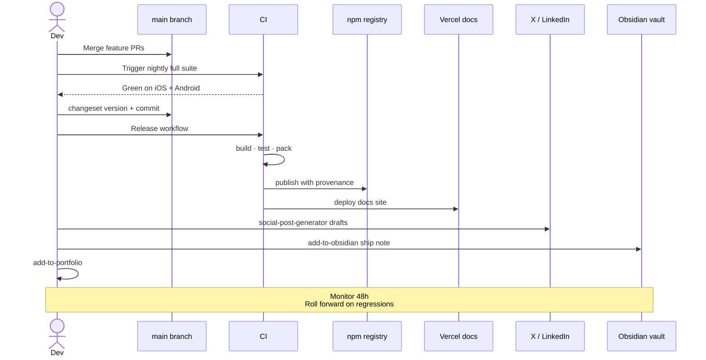
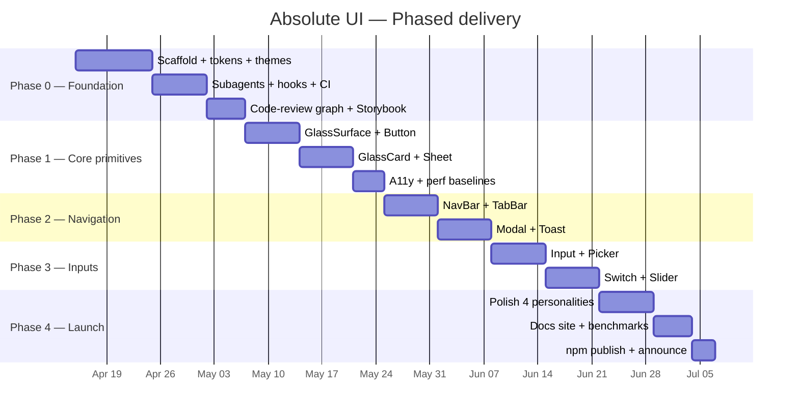
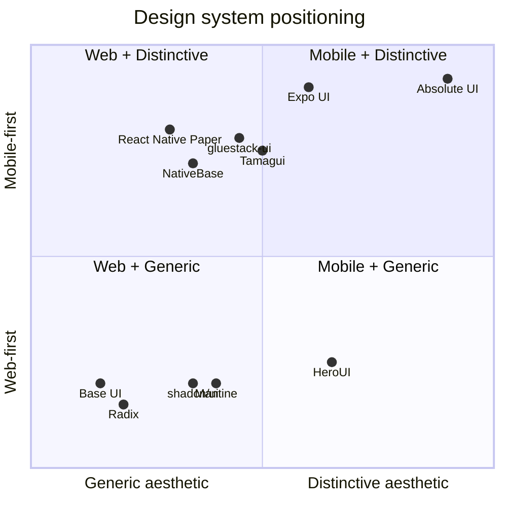
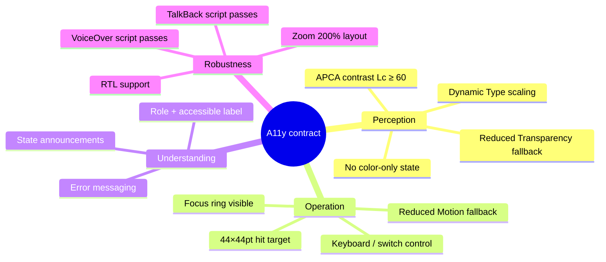
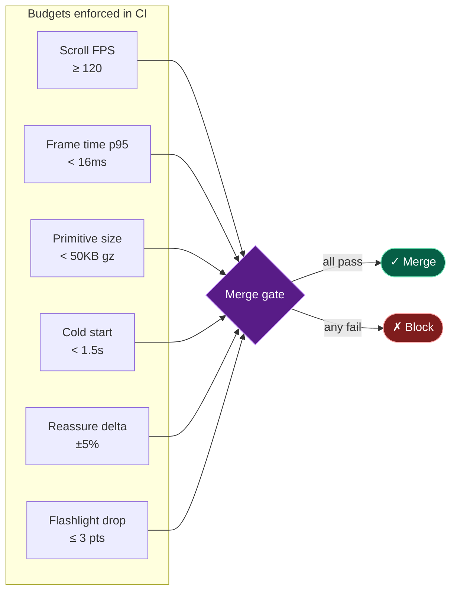

# Absolute UI — Visual Diagrams

All diagrams are written in **Mermaid** so they render natively on GitHub, in the docs site (MDX), in Obsidian, and in most markdown viewers. No external tools required.

---

## 1. System architecture (layers)

---

## 2. Agent & skill orchestration

```mermaid
graph LR
    DEV[Developer]

    subgraph "Planning skills"
        PLAN[Plan agent]
        EXP[Explore agent]
    end

    subgraph "Build skills"
        FD[frontend-design]
        VCP[vercel-composition-patterns]
        VRN[vercel-react-native-skills]
    end

    subgraph "Quality subagents"
        PA[perf-auditor]
        AA[a11y-auditor]
        PP[pixel-perfect]
        TA[test-automator]
    end

    subgraph "Review skills"
        CRD[review-delta]
        CRP[review-pr]
        SIM[simplify]
    end

    subgraph "Release skills"
        DV[deploy-to-vercel]
        SP[social-post-generator]
        AP[add-to-portfolio]
        AO[add-to-obsidian]
    end

    DEV --> PLAN --> EXP
    EXP --> FD
    FD --> VCP --> VRN
    VRN --> TA
    TA --> AA
    AA --> PP
    PP --> PA
    PA --> CRD --> CRP --> SIM
    SIM --> DV
    DV --> SP --> AP --> AO

    style PA fill:#581c87,stroke:#c084fc,color:#fff
    style AA fill:#7c2d12,stroke:#fb923c,color:#fff
    style PP fill:#164e63,stroke:#67e8f9,color:#fff
    style TA fill:#0f766e,stroke:#5eead4,color:#fff
```

---

## 3. New-component workflow (end-to-end)

---

## 4. Test pyramid (5 layers)

---

## 5. CI pipeline

```mermaid
flowchart LR
    PUSH[git push / PR] --> STATIC[Static<br/>biome · tsc · a11y-lint]
    STATIC --> UNIT[Unit + integration<br/>jest]
    UNIT --> VIS[Visual regression<br/>chromatic]
    VIS --> PERF[Perf regression<br/>reassure]
    PERF --> FLASH[Flashlight<br/>on-device FPS/CPU/mem]
    FLASH --> BUNDLE[Bundle-size diff]
    BUNDLE --> ADV[review-delta<br/>advisory]
    ADV --> E2E[Maestro E2E<br/>nightly + pre-release]
    E2E --> MERGE{Merge gate}

    MERGE -->|green| MAIN([main])
    MERGE -->|red| BLOCK([Blocked])

    style STATIC fill:#064e3b,stroke:#6ee7b7,color:#fff
    style UNIT fill:#065f46,stroke:#6ee7b7,color:#fff
    style VIS fill:#0f766e,stroke:#5eead4,color:#fff
    style PERF fill:#155e75,stroke:#67e8f9,color:#fff
    style FLASH fill:#155e75,stroke:#67e8f9,color:#fff
    style E2E fill:#1e40af,stroke:#93c5fd,color:#fff
    style MAIN fill:#065f46,stroke:#6ee7b7,color:#fff
    style BLOCK fill:#7f1d1d,stroke:#fca5a5,color:#fff
```

---

## 6. Release flow

---

## 7. Phased roadmap (Gantt)

---

## 8. Competitive landscape (2×2)

---

## 9. A11y contract per primitive

---

## 10. Performance budget

---

## Rendering notes

- **GitHub / GitLab / Obsidian:** render natively, no config.
- **VS Code:** install the "Markdown Preview Mermaid Support" extension.
- **Docs site (Next.js):** use `@mermaid-js/mermaid` via MDX.
- **Export to PNG/SVG:** `npx @mermaid-js/mermaid-cli -i DIAGRAMS.md -o diagrams/` (run once before release).
